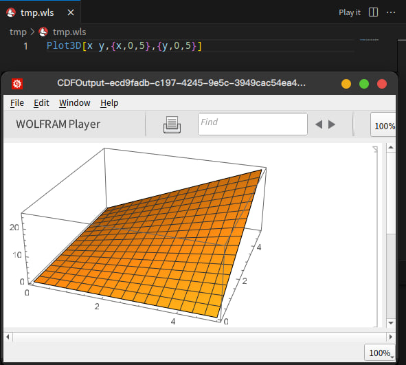

# mmaplayer

show dynamic result in wolfram player.

Make sure you have `wolframscript` and `wolframplayer` in your `PATH`.

---

Play it 😆



---

## Development

<kbd>F5</kbd>

## Build

```sh
vsce package
```

No `node_modules`
